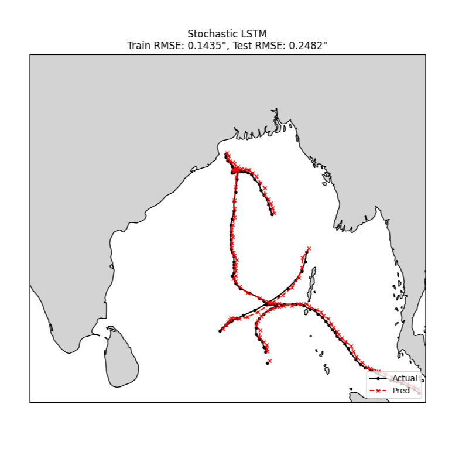
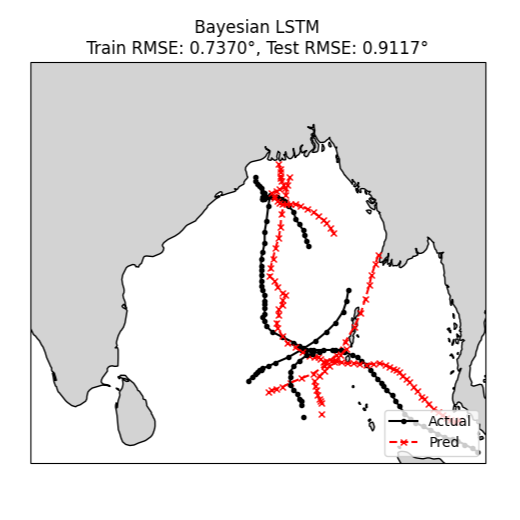

# Bayesian & Stochastic LSTM for Cyclone Tracking

This repository implements two variants of LSTMs to predict cyclone trajectories (Latitude/Longitude) using the IBTrACS dataset.

## Results

| Model | Train RMSE (Normalized)| Test RMSE (Normalized) | Train RMSE (Degrees) | Test RMSE (Degrees) |
| :--- | :--- | :--- | :--- | :--- |
| Stochastic LSTM | 0.0057 | 0.0097 | 0.1435°| 0.2482° |
| Bayesian LSTM |0.0301 | 0.0373| 0.7370° | 0.9117° |

| SLSTM | BLSTM  |
| :---: | :---: |
|  |  |

## Model Comparisons

| Model | Core Mechanism | Training Objective |
| --- | --- | --- |
| **Stochastic LSTM** (`slstm.py`) | Uses Weight Uncertainty (BayesLinear) during inference via stochastic sampling. | Standard **MSE Loss** only. |
| **Bayes LSTM** (`blstm.py`) | Full Variational Inference with weight distributions. | **ELBO**: MSE Loss + Weighted **KL Divergence**. |

---

### Stochastic LSTM
Uses Monte Carlo (MC) sampling at inference to estimate uncertainty, but lacks a training constraint (like KL Divergence), allowing weights to overfit. It runs 50 forward passes with different weight realizations and averaging the results to generate a prediction.

### Bayes LSTM

In addition to stochastic sampling, it includes a **KL Divergence** term in the loss function. This regularizes the learned weights to remain close to a prior distribution, improving uncertainty quantification and preventing overfitting. The performance of the BayesLSTM can be tweaked by changing the `prior_var` and `kl_weight` values.

### Conclusion

The Stochastic LSTM is the superior model, delivering a 72.8% reduction in error compared to the Bayesian LSTM. While its test error is roughly double its training error, the absolute magnitude (0.2482°) remains remarkably low, suggesting high precision rather than problematic overfitting. The Bayesian LSTM is more conservative and generalizes more consistently between sets, but its significantly higher error makes it less ideal for applications requiring sub-degree accuracy.